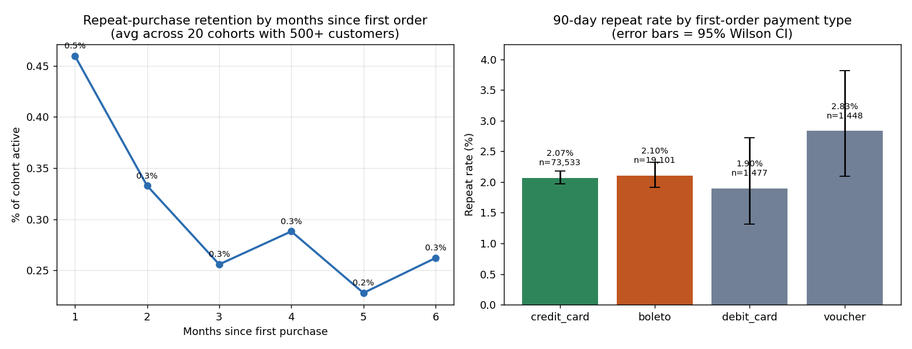

<h1 align="center">Olist SQL Analysis & Hypothesis Test</h1>

<p align="center">
  <a href="https://github.com/prabhathv07/olist-sql-experimentation/actions/workflows/ci.yml">
    
  </a>
  
  
  
  
  
  
  <a href="LICENSE">
    
  </a>
</p>

End-to-end SQL analysis and hypothesis test on the real Olist Brazilian e-commerce dataset (**99,441 orders / 96,096 customers, Sep 2016 – Oct 2018**). Six DuckDB analytical queries built around window functions drive a monthly cohort retention matrix; a formal power analysis and two-proportion z-test settle a common growth hypothesis with a well-powered null.

All numbers below come from a verified run on the official Olist data — not synthetic data.

---

## TL;DR

- Tested: *do credit-card-first customers retain better than boleto-first customers?*
- Result: **credit_card 2.07% vs boleto 2.10%** 90-day repeat rate (Δ = −0.03 pp, **p = 0.76**, 95% CI [−0.27, +0.19] pp)
- The test could reliably detect a gap as small as **0.34 pp** (α = 0.05, power = 0.80) — the null is *confident*, not underpowered
- Bigger finding: only **2,997 of 96,096 customers (3.1%) ever order a second time** — retention investment should target the **first → second purchase**, not payment method
- Full recommendation in [`RECOMMENDATION.md`](RECOMMENDATION.md)

---

## Architecture

```
              ┌─────────────────────────────────────────────────────┐
              │  Raw data: Kaggle Olist SQLite dump (olist.sqlite)  │
              │  customers · orders · order_items · order_payments  │
              └────────────────────────┬────────────────────────────┘
                                       │  sqlite3 export to CSV
                                       ▼
                          ┌─────────────────────────┐
                          │  data_real/*.csv        │
                          │  (read by DuckDB)       │
                          └────────────┬────────────┘
                                       │
                                       ▼
   ┌──────────────────────────────────────────────────────────────────┐
   │                        02_run_sql.py                              │
   │  · loads CSVs into an in-memory DuckDB                            │
   │  · executes 02_analysis.sql (spine view + 6 @export queries)      │
   │  · writes one CSV per query into results/                         │
   └────────────┬─────────────────────────────────────────────────────┘
                │
                ├──► order_spine                view (ROW_NUMBER, MIN,
                │                               FIRST_VALUE windows)
                │
                ├──► Q1 monthly_revenue         SUM() OVER + LAG()
                ├──► Q2 repeat_gap              LAG() over each timeline
                ├──► Q3 state_leaderboard       RANK() + SUM() OVER ()
                ├──► Q4 daily_orders_ma         7-day windowed frame
                ├──► Q5 cohort_retention        monthly cohort matrix
                └──► Q6 repeat_by_payment       experiment input table
                                       │
                                       ▼
   ┌──────────────────────────────────────────────────────────────────┐
   │                       03_experiment.py                            │
   │  1. State H0 / H1 (two-sided, α = 0.05)                          │
   │  2. Power analysis: MDE for current N + required N for new A/B   │
   │  3. Two-proportion z-test + Newcombe CI + chi-square cross-check │
   │  → results/experiment_output.txt                                  │
   └────────────┬─────────────────────────────────────────────────────┘
                │
                ▼
   ┌──────────────────────────────────────────────────────────────────┐
   │                        04_figures.py                              │
   │  · cohort retention curve (months 1–6)                            │
   │  · 90-day repeat rate by first payment type, 95% Wilson CIs       │
   │  → results/summary_figure.png                                     │
   └────────────┬─────────────────────────────────────────────────────┘
                │
                ▼
   ┌──────────────────────────────────────────────────────────────────┐
   │                       RECOMMENDATION.md                           │
   │  1-page PM-facing writeup: finding, why I trust the null,         │
   │  what I'd do next, sample-size math for a follow-up A/B test.     │
   └──────────────────────────────────────────────────────────────────┘
```

---

## Approach

### Dataset

| Field | Value |
|---|---|
| Source (used) | [E-commerce dataset by Olist as an SQLite database](https://www.kaggle.com/datasets/terencicp/e-commerce-dataset-by-olist-as-an-sqlite-database) (Kaggle, `olist.sqlite`) |
| Alternative source (same data) | [Brazilian E-Commerce Public Dataset by Olist – raw CSVs](https://www.kaggle.com/datasets/olistbr/brazilian-ecommerce) (Kaggle) |
| Period | Sep 2016 – Oct 2018 (25 monthly cohorts) |
| Orders | 99,441 |
| Customers (unique people) | 96,096 |
| Repeat customers (≥ 2 orders) | 2,997 (3.1%) |
| Tables used | `customers`, `orders`, `order_items`, `order_payments` |
| Geography | 27 Brazilian states (SP, RJ, MG ≈ 63% of revenue) |

The SQLite dump is preferred over the raw CSVs because it preserves exact column types and is a single file to manage. DuckDB can attach SQLite databases directly (via the `sqlite` extension) or read the CSVs through `read_csv_auto()` — the SQL in `02_analysis.sql` is identical for both paths since the table and column names align.

`orders` carries the timestamp that drives cohorts and retention; `customers` links the per-order `customer_id` back to a stable `customer_unique_id` (so each *person* appears once); `order_payments` carries the lever this project tests — the payment method on the first order. Cancelled orders are filtered out in the spine view so they do not pollute revenue or retention numbers.

### Data Sources

- **Olist Brazilian e-commerce (SQLite)** — [kaggle.com/datasets/terencicp/e-commerce-dataset-by-olist-as-an-sqlite-database](https://www.kaggle.com/datasets/terencicp/e-commerce-dataset-by-olist-as-an-sqlite-database)
- **Olist Brazilian e-commerce (raw CSVs)** — [kaggle.com/datasets/olistbr/brazilian-ecommerce](https://www.kaggle.com/datasets/olistbr/brazilian-ecommerce) *(drop-in alternative)*

Tooling references:

- **DuckDB** — [duckdb.org](https://duckdb.org/) (window functions, sqlite extension, `read_csv_auto`)
- **statsmodels** — [statsmodels.org](https://www.statsmodels.org/) (`NormalIndPower`, `proportions_ztest`, `confint_proportions_2indep`)
- **SciPy stats** — [docs.scipy.org](https://docs.scipy.org/doc/scipy/reference/stats.html) (`chi2_contingency`)

### The `order_spine` View

Every downstream query reads from a single CTE-style view (`order_spine`) that attaches the heavy window-function attributes to each order in one place:

| Column | Window used | Why it matters |
|---|---|---|
| `order_seq` | `ROW_NUMBER() OVER (PARTITION BY person ORDER BY ts)` | Defines first / second / third order without a self-join |
| `first_ts` | `MIN(ts) OVER (PARTITION BY person)` | 90-day repeat window pivots off this |
| `cohort_month` | `date_trunc('month', MIN(ts) OVER (...))` | Drives the retention matrix |
| `first_payment_type` | `FIRST_VALUE(payment_type) OVER (PARTITION BY person ORDER BY ts)` | The experimentation lever |
| `payment_value` / `payment_type` (per order) | `arg_min(payment_type, payment_sequential)` on collapsed payments | Real Olist allows split payments — this picks the primary type and totals the amount |

### SQL Queries (`02_analysis.sql`)

| # | Question | Key window function |
|---|---|---|
| Q1 | Monthly revenue, running total, month-over-month growth | `SUM() OVER (ORDER BY order_month)` + `LAG()` |
| Q2 | Days between 1st → 2nd → 3rd order per person | `LAG(ts) OVER (PARTITION BY person ORDER BY ts)` |
| Q3 | State revenue leaderboard with rank, share, and cumulative share | `RANK() OVER (ORDER BY revenue DESC)` + `SUM() OVER ()` |
| Q4 | 7-day moving average of daily orders | `AVG() OVER (ORDER BY day ROWS BETWEEN 6 PRECEDING AND CURRENT ROW)` |
| Q5 | Monthly acquisition cohort × months-since-first retention matrix | `MIN()` / `FIRST_VALUE()` windows in the spine feeding a `COUNT(DISTINCT)` aggregation |
| Q6 | 90-day repeat rate per first-order payment type | Reads `order_seq` and `first_ts` from the spine; feeds the experiment |

Q1, Q3, and Q4 are the "growth dashboard" queries a stakeholder would ask for, each exercising a different `OVER()` pattern (running total, share of total, sliding frame). Q2 and Q5 answer the retention question two ways — gap distribution and cohort matrix — so the recommendation does not rest on a single number. Q6 is deliberately the input to the experiment script: it produces one row per *person* with the first-order payment type and a 90-day repeat flag, giving the significance test a clean person-level dataset.

### Experimentation Pipeline (`03_experiment.py`)

| Step | Method | Library |
|---|---|---|
| State H0 / H1 | Two-sided, α = 0.05, primary metric = 90-day repeat | — |
| Power analysis (a) MDE for current sample | `NormalIndPower.solve_power(effect_size=None, nobs1=n_cc, power=0.80, ratio=n_bo/n_cc)` + Cohen's h → pp conversion | `statsmodels` |
| Power analysis (b) Required N for a fresh balanced A/B | `NormalIndPower.solve_power(effect_size=es_obs, nobs1=None, power=0.80, ratio=1.0)` | `statsmodels` |
| Power analysis (c) Post-hoc power of the test we ran | `NormalIndPower.solve_power(effect_size=es_obs, nobs1=n_cc, ratio=...)` | `statsmodels` |
| Significance test | Two-proportion z-test (`proportions_ztest`) | `statsmodels` |
| Confidence interval | Newcombe method on the difference of proportions (`confint_proportions_2indep`) | `statsmodels` |
| Cross-check | Chi-square test of independence on the 2×2 table | `scipy.stats` |

The MDE step is what lets us call this a *confident* null rather than "we didn't find anything" — it quantifies what effect size we could have reliably detected with the data we have.

---

## Results

### Monthly Revenue (Q1, first 6 months)

| Month | Orders | Revenue (R$) | Running total | MoM growth |
|---|---:|---:|---:|---:|
| 2016-09 | 2 | 136.23 | 136.23 | — *(pilot: 2 orders)* |
| 2016-10 | 300 | 53,915.50 | 54,051.73 | — *(pilot: first real month)* |
| 2016-12 | 1 | 19.62 | 54,071.35 | — *(pilot: gap month)* |
| 2017-01 | 797 | 138,119.76 | 192,191.11 | — *(pilot: ramp-up)* |
| 2017-02 | 1,763 | 289,081.01 | 481,272.12 | +109.3% |
| 2017-03 | 2,649 | 442,406.37 | 923,678.49 | +53.0% |

MoM growth is suppressed for the four pilot months (Sep 2016 – Jan 2017) — percentage changes off a near-zero base are arithmetically correct but meaningless as a signal. From Feb 2017 onward, when the base is stable, MoM growth is a reliable metric. The platform went from 2 orders to 2,649/month in six months.

### Repeat-Purchase Gap Distribution (Q2)

| Order # | Customers reaching it | Avg days since previous | Median days |
|---:|---:|---:|---:|
| 1 | 96,096 | 0.0 | 0.0 |
| 2 | 2,923 | 81.3 | 28.0 |
| 3 | 236 | 62.4 | 38.0 |
| 4 | 49 | 66.0 | 32.0 |

Median time to second order is ~28 days but the mean is ~81 — a long right tail. The 2–8 week post-delivery window is where a retention intervention would land.

### Top States by Revenue (Q3, top 5)

| Rank | State | Orders | Revenue (R$) | Share | Cumulative share |
|---:|---|---:|---:|---:|---:|
| 1 | SP | 41,419 | 5,942,397.11 | 37.5% | 37.5% |
| 2 | RJ | 12,766 | 2,126,444.23 | 13.4% | 50.9% |
| 3 | MG | 11,571 | 1,856,375.81 | 11.7% | 62.6% |
| 4 | RS | 5,441 | 881,680.60 | 5.6% | 68.1% |
| 5 | PR | 5,023 | 802,319.18 | 5.1% | 73.2% |

São Paulo alone accounts for 37.5% of revenue; the top 3 states (SP, RJ, MG) account for 62.6% — classic geographic concentration.

### Cohort Retention Matrix (Q5, excerpt)

| Cohort | Size | M0 | M1 | M2 | M3 | M4 | M5 | M6 |
|---|---:|---:|---:|---:|---:|---:|---:|---:|
| 2017-05 | 3,571 | 100% | 0.48% | 0.50% | 0.39% | 0.31% | 0.34% | 0.42% |
| 2017-08 | 4,162 | 100% | 0.67% | 0.34% | 0.26% | 0.36% | 0.53% | 0.29% |
| 2018-01 | 7,222 | 100% | 0.54% | 0.42% | 0.30% | 0.28% | 0.21% | 0.18% |

Retention at month 1 averages ~0.5% across cohorts of 500+ customers, decaying to ~0.25% by month 6. The marketplace is overwhelmingly one-purchase.

### Experiment (Q6 + `03_experiment.py`)

| Stage | Output |
|---|---|
| Observed | credit_card: 1,522 / 73,533 = **2.07%**  ·  boleto: 402 / 19,101 = **2.10%** |
| Absolute difference | **−0.03 pp** (CI [−0.27, +0.19] pp) |
| Relative lift | −1.7% |
| Z-test | z = −0.300, **p = 0.764** |
| Chi-square | χ² = 0.090, **p = 0.764** |
| MDE @ α = 0.05, power = 0.80 | Cohen's h = 0.023, ≈ **0.34 pp** absolute at the 2.10% base |
| Post-hoc power | 0.060 |
| Required N per arm to detect the observed h | 2,651,577 per arm |
| Verdict | **Fail to reject H0** — well-powered null |

### 90-Day Repeat Rate Across All Payment Types

| First payment | Customers | Repeaters (90d) | Repeat rate |
|---|---:|---:|---:|
| Credit card | 73,533 | 1,522 | 2.07% |
| Boleto | 19,101 | 402 | 2.10% |
| Voucher | 1,448 | 41 | 2.83% |
| Debit card | 1,477 | 28 | 1.90% |

Voucher looks highest but rests on 1,448 customers with a wide 95% Wilson CI that overlaps every other group — not a strategy lever.

---

## Business Insights

### 1. Olist is effectively a one-purchase marketplace

Across 96,096 customers, only 2,997 (3.1%) ever order a second time. Cohort retention sits around 0.5% one month after the first order and decays to ~0.25% by month six. This single fact reframes what the growth team should be working on.

### 2. The payment-method hypothesis is a confident null

The popular intuition — "credit-card buyers retain better than boleto buyers" — does not hold in this data. The 2.07% vs 2.10% gap is essentially zero with a tight CI, and the post-hoc power is low (0.060) precisely because the *true effect* is tiny. With the sample available, anything ≥ 0.34 pp would have been detected, so a real, commercially meaningful gap is simply not there.

### 3. The opportunity is the first → second order gap

Median time to a second order is ~28 days (mean ~81). The 2–8 week post-delivery window is the right place to intervene. A 1 pp absolute lift on a 2% base is a ~50% relative improvement in repeat customers — a much larger lever than anything payment method could provide.

### 4. A follow-up A/B test is feasible

To detect a 1 pp lift on a 2% base at α = 0.05 / power = 0.80 requires roughly **6,400 customers per arm** — well within a month of Olist's volume. The recommendation memo lays out the design, primary metric (90-day repeat), guardrail (margin), and pre-committed decision rule.

---

## Visual Output



`results/summary_figure.png` has two panels:

- **Left:** average cohort retention curve (months 1 → 6 after first order), averaged across 20 cohorts of 500+ customers.
- **Right:** 90-day repeat rate by first-order payment type, with 95% Wilson confidence intervals as error bars. Credit card and boleto sit almost exactly on top of each other — the visual version of the p = 0.76 result.

---

## Tech

| Component | Technology | Version |
|---|---|---|
| Language | Python | 3.12 |
| SQL engine | DuckDB | 1.5 (in-memory, no setup) |
| Stats | statsmodels | 0.14 |
| Stats (cross-check) | scipy | 1.x |
| Data wrangling | pandas, numpy | 2.x |
| Plots | matplotlib | 3.x (`Agg` backend, no display needed) |
| CI | GitHub Actions | — |

No notebook required — the project is four scripts plus one `.sql` file.

---

## Files

| File | What it does |
|---|---|
| `02_analysis.sql` | 6 analytical queries (window functions) + the `order_spine` view |
| `02_run_sql.py` | Loads `data_real/` or the SQLite dump into DuckDB, runs the SQL, writes `results/*.csv` |
| `03_experiment.py` | H0/H1, power analysis, z-test, Newcombe CI, chi-square; writes `results/experiment_output.txt` |
| `04_figures.py` | `results/summary_figure.png` |
| `RECOMMENDATION.md` | 1-page PM-facing memo |
| `01_generate_data.py` | Fallback Olist-style synthetic generator (only used if the real CSVs are absent) |
| `results/` | All query outputs, the experiment log, and the summary figure |

---

## Run

### 1. Install dependencies

```bash
pip install -r requirements.txt
```

Or one-shot: `pip install duckdb statsmodels scipy pandas matplotlib numpy`

### 2. Get the data

Download the Kaggle [Olist SQLite database](https://www.kaggle.com/datasets/terencicp/e-commerce-dataset-by-olist-as-an-sqlite-database) to `data/olist.sqlite`, then export the four tables to CSV:

```bash
mkdir -p data_real
python3 -c "import sqlite3, pandas as pd; con = sqlite3.connect('data/olist.sqlite'); \
[pd.read_sql(f'SELECT * FROM \"{t}\"', con).to_csv(f'data_real/{t}.csv', index=False) \
 for t in ['customers', 'orders', 'order_items', 'order_payments']]"
```

If you don't have the SQLite dump, run the fallback synthetic generator instead — the schema and SQL are identical:

```bash
python3 01_generate_data.py
```

### 3. Run the pipeline

```bash
python3 02_run_sql.py        # 6 queries → results/q*.csv
python3 03_experiment.py     # power analysis + z-test → results/experiment_output.txt
python3 04_figures.py        # summary chart → results/summary_figure.png
```

Each script is independent and idempotent — re-running any one of them just overwrites its own outputs in `results/`.

---

## What's Next

- **Run the recommended follow-up A/B test** — randomise first-time buyers to a post-purchase re-engagement flow vs control, primary metric 90-day repeat, ~6,400 per arm.
- **Segment-level retention** — break the cohort matrix by state, product category, and order value to find where a uniform program would miss variation.
- **Survival analysis** — a Kaplan-Meier curve on time-to-second-order, since the long right tail (mean 81 vs median 28 days) suggests a non-exponential return distribution.
- **Causal layer** — propensity-score matching on basket size, state, and category to check whether the payment-method null holds when confounders are controlled.

---

## License

This project is licensed under the MIT License — see [LICENSE](LICENSE) for details.
